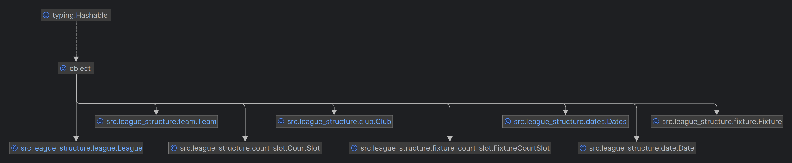

# Badminton League Scheduling Optimisation

This repository contains a constraint optimisation programme designed to automate seasonal fixture scheduling for multi-division sports leagues. The system replaces a time-intensive manual process with a deterministic Operational Research framework. It generates a provably fair schedule that respects venue availability, team preferences, and physical constraints.

## The Mathematical Model

The scheduling intelligence is powered by the Google OR-Tools constraint solver. The physical rules of the sport are encoded as a Constraint Satisfaction Problem. 

The model uses binary decision variables to represent match allocations. A variable $X_{f, s}$ equals $1$ if fixture $f$ is assigned to court slot $s$, and $0$ otherwise. 

### Hard Constraints

These rules define the feasible solution space. A schedule is only generated if all of these conditions are met strictly:

*   **Fixture Completion:** Every required round-robin fixture must be assigned to exactly one available court slot.
*   **Slot Capacity:** A physical court slot can host a maximum of one fixture.
*   **Venue Assignment:** Home fixtures must be scheduled exclusively within court slots owned by the home team's club.
*   **Date Conflicts:** A team cannot play multiple fixtures on the same calendar date.
*   **Club Court Limits:** The total number of home matches hosted by all teams at a single club on a specific date cannot exceed the club's physical court capacity.
*   **Holiday Blackouts:** No fixtures can be scheduled on defined blackout dates.

### Soft Constraints

When the solver identifies multiple valid schedules, objective penalty functions guide the output towards the most equitable distribution. The solver minimises the total sum of these penalties:

*   **Temporal Spacing:** Penalises schedules where a team plays matches on consecutive days or within a short rest window.
*   **Home and Away Alternation:** Penalises long consecutive streaks of either home or away matches to balance travel requirements.
*   **Intra-Club Fixture Spacing:** Penalises instances where multiple teams from the same club are scheduled to play on the same date. This ensures clubs have enough available players to cover absences across their divisions.

## System Architecture & Software Engineering

The codebase prioritises clear structural boundaries and automated quality checks. The physical rules of the sport are isolated in the `src/league_structure/` directory, separating domain data from the mathematical solver logic. The application operates as an automated data pipeline to remain accessible for non-technical league administrators.

1.  **Ingestion:** The programme pulls raw club parameters and venue availability from Google Sheets via the Google Workspace API.
2.  **Optimisation:** The `scheduling.py` module formulates the decision variables and executes the combinatorial search engine.
3.  **Analytics:** The `league_analysis.py` module evaluates the generated schedule against fairness metrics.
4.  **Publishing:** The validated schedule is exported directly back into the connected Google Sheet.

## First-Time Set-Up and Execution

This project uses Google Sheets to ingest the league structure and club availability. Running the pipeline requires configuring API access and preparing the specific template files.

### 1. Application Authentication

To allow the programme to read and write to Google Sheets, you must configure a Google Cloud Service Account.

1.  Navigate to the Google Cloud Console (console.cloud.google.com).
2.  Create a new project and enable the Google Sheets API and Google Drive API.
3.  Set up a Service Account and generate a new JSON key.
4.  Download the JSON key, rename it to `client_secret.json`, and place it in the root directory of this project.

### 2. Prepare the Spreadsheets

The data pipeline relies on specific spreadsheet templates for club entries and league management. 

1.  Copy the [Club Entry Template](https://docs.google.com/spreadsheets/d/1eftYZbRXSH1wP_ocnDws7KhLqCdlDXpDypOlOMH20Hg/edit?usp=drive_link) for each participating club.
2.  Ensure the entry templates contain the required tabs: '0. Club Information', '1. Teams Entering', '2. Availability', '3. Check Provided Enough Dates', and 'Lookup Lists'.
3.  Update the 'Lookup Lists' with any new teams and verify the dropdown references include these new values.
4.  Update the '2. Availability' sheet with the current season's league dates and bank holidays, resizing the availability table if necessary.
5.  Assign teams to their appropriate divisions within the sheets.
6.  Distribute the entry sheets to clubs for population.
7.  Link all completed entry spreadsheets to your master [League Management Template](https://docs.google.com/spreadsheets/d/1eyk5vBiaWu91fqs5jhaS4sJYS6Frm4Z23z8ZQdZbR5o/edit?usp=sharing). This master sheet receives the final output schedule.

### 3. Execution

1.  Install the project dependencies defined in `pyproject.toml` or `requirements.txt`.
2.  Share all necessary Google Sheets with the email address associated with your Service Account (found in `client_secret.json`), granting it Editor permissions.
3.  Update the API references in the codebase to link to the current year's file IDs.
4.  Execute `main.py` to trigger the ingestion and scheduling pipeline.
   
